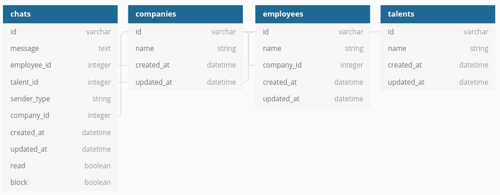

# Chat

Clone this project then:  

```
$ bundle install
$ rails db:setup
$ rails server
```

Example call: `localhost:3000/talent/chats`  

### Talent View
| method | path                           | body              | description                 |
|--------|--------------------------------|-------------------|-----------------------------|
| GET    | /talent/chats                  |                   | list all chats              |
| POST   | /talent/chats/:company_id      | {"message": ".."} | send a message to the chat  |
| GET    | /talent/chats/:company_id      |                   | list chat messages          |
| POST   | /talent/chats/:company_id/read |                   | read messages from the chat |


### Employee View
| method | path                               | body              | description                 |
|--------|------------------------------------|-------------------|-----------------------------|
| GET    | /employee/chats                    |                   | list all chats              |
| POST   | /employee/chats/:talent_id         | {"message": ".."} | send a message to the chat  |
| GET    | /employee/chats/:talent_id         |                   | list chat messages          |
| POST   | /employee/chats/:talent_id/read    |                   | read messages from the chat |
| POST   | /employee/chats/:talent_id/execute | {"job": "block"}  | block a chat                |
| POST   | /employee/chats/:talent_id/execute | {"job": "offer"}  | send an offer               |

[](https://insomnia.rest/run/?label=Chat%20API&uri=https%3A%2F%2Fraw.githubusercontent.com%2Femanuelhfarias%2Fchat%2Fmaster%2Frequests.json%3Ftoken%3DAATJ7MLCBRGGQAJF5AUOLCK72H6SG)

### Schema


### Improvements
* remove similar queries  
* use resources on `routes.rb` instead of list all routes  